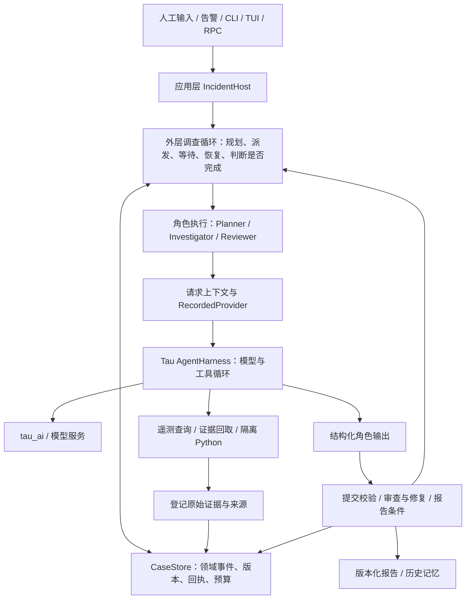

# Ariadne 架构与改进事项地图

日期：2026-09-28。统一改造实现与验收见[持续调查 v2](incident-agent-v2.md)。
本文保留改造前的问题地图，便于追踪 P1–P10；下方描述原限制的段落为历史审计。
当前角色不设轮次或总周期时限；默认案件无 token 限额，任务没有独立额度。
状态收敛为 Task.progress、Attempt 执行身份、Claim 类型依赖与冻结 Finding；
Case 展示、读取清单和 usage 都从对应权威记录派生。共享诊断策略位于
`readiness.py`，角色工具增加 `save_progress` 和 `context_read`。
新旧存储隔离，旧案件只读；没有旧案继续执行迁移。详见上述 v2 记录中的权威归属表。
Stage 1–6 仍为实现完成、待统一验证；Stage 7 仍在验证中。按用户要求，本轮不运行真实模型。

## 1. Tau 提供什么，Ariadne 增加什么

Tau 提供通用模型与工具执行能力，以及围绕编码任务的应用环境。
Ariadne 复用执行能力，增加围绕持久案件的调查环境与控制策略。

| 层 | Tau 已有能力 | Ariadne 的使用或增量 |
| --- | --- | --- |
| `tau_ai` | 供应商适配、模型响应流 | 复用 provider；应用层注入固定模型、输出限制等配置。不是案件状态管理层 |
| `tau_agent` | AgentHarness、模型/工具循环、消息、事件、取消、工具前后回调 | 复用；新增通用请求上下文 hook 和投影协议检查，领域规则仍留在外部 |
| `tau_coding` 原有编码环境 | CodingSession、资源和扩展加载、会话持久化/压缩、CLI/RPC/TUI | 保留 coding 模式；增加案件绑定和入口。调查 worker 不自动继承 CodingSession 的工具、历史和压缩 |
| `tau_incident` 新增领域包 | 无对应的原有案件系统 | Case、证据、提交协议、规划、任务执行、上下文、预算与恢复、审查、报告和记忆 |
| `tau_coding/incident` 新增应用组装 | 复用原有配置、路径和 provider 设施 | IncidentHost、运行队列、daemon、告警入口、接口；注入遥测、Docker 分析和 OTel 适配 |

`AgentHarnessConfig.max_turns` 原本允许不设上限。此前讨论的角色默认 8 轮，是
Ariadne 的 `RunLimits` / `RoleRunner` 策略，不是 Tau 核心强制要求。

## 2. 两层循环

- **内层循环**回答“这次模型请求后调用什么工具、怎样继续对话”。Tau 实现这部分。
- **外层循环**回答“下一个调查问题是什么、哪个任务可运行、是否需要审查、什么时候结束”。Ariadne 实现这部分。
- 每个角色是提示词、上下文、工具和输出契约的组合，不是一个永远在线的独立进程。
  worker 使用独立 Harness/provider；任务并行由外层调度负责。
- `coordinator.py` 的 IncidentRuntime 提供权威命令入口和生命周期；
  `investigation.py` 承载调查调度循环；`IncidentHost` 负责应用资源与后台运行。
  三者不是同一个“Coordinator”。

## 3. 八个职责区域

这些是管理代码的逻辑分组，不是建议再创建八个服务。

| 区域 | 负责的问题 | 主要源码 | 对应 Stage |
| --- | --- | --- | --- |
| A 案件与提交 | 什么已经被接受、重复或过期提交如何处理 | `models.py`、`events.py`、`store/`、`submission.py`、`coordinator.py` | 1、3 |
| B 调查规划与调度 | 接下来查什么、任务依赖与并发、何时继续或等待 | `planner.py`、`investigation.py`、`store/control.py` | 2、3 |
| C 角色执行与长期运行 | 一段执行怎样开始、暂停、恢复、计费、失败 | `executor.py`、`budget.py`、`recovery.py`、应用 `investigation.py` | 2、3 |
| D 上下文与工作信息 | 每次请求看到什么、哪些材料可省略、怎样回取 | `context.py`、`execution/provider.py`、Tau `request_context.py` | 2、3 |
| E 判断质量与交付 | 判断如何审查、如何修复、何时形成完整报告 | `review.py`、`quality.py`、`reporting/`、`memory/` | 4 |
| F 证据与分析工具 | 数据来自哪里、覆盖是否可信、脚本如何分析 | `evidence/`、`telemetry/`、`analysis/`、应用 `services.py` / `analysis.py` | 1、2、5 |
| G 产品入口与运行环境 | 怎样开案、连接、接收告警、长期运行 | 应用 `host.py`、`service.py`、`intake.py`、CLI/RPC、TUI 案件工作区 | 6 |
| H 追踪与验证 | 发生过什么、花费多少、哪些行为已被验证 | `execution/`、应用 `otel.py` / `views.py`、`tests/incident/`、验证脚本 | 跨阶段；7 集中验证 |

源码中的领域路径均相对于 `src/tau_incident/`，应用路径相对于 `src/tau_coding/incident/`。
Stage 表示建设顺序；职责区域表示长期维护边界。一个改动可能跨多个 Stage，但应有一个主要责任区域。

## 4. 一次调查如何积累状态

1. Host 将人工描述或告警写入 Case。Case 是持续存在的案件，不是一次聊天。
2. Planner 根据已接受状态提出任务。Task 描述目标、范围、完成条件和允许工具。
3. 调度器为任务创建 TaskAttempt，登记所有权、代次和预算预留。
4. RoleRunner 配置独立 Harness；ContextBuilder 选择材料，RecordedProvider 保存请求快照并计账。
5. 工具结果登记为 Observation，原始内容保存为 artifact，携带来源、时间、覆盖及版本。
6. worker 返回 Finding，说明已取得的观察、完成情况、缺口和拟提交判断。
7. 提交协议检查身份、版本、授权读取和契约。接受 Finding 不等于证明根因正确。
8. Claim 进入审查；必要时创建修复任务，随后继续调查或生成报告。
9. ReportBuilder 根据已接受状态生成版本化报告。MemoryCard 为以后案件提供历史线索。

| 名称 | 易混淆的区别 |
| --- | --- |
| Case / CodingSession | Case 保存调查事实；CodingSession 保存交互。聊天分支不回滚 Case |
| Task / TaskAttempt | Task 是工作契约；Attempt 是一次具体执行，重试有新身份 |
| Observation / Claim | Observation 是工具或人工登记的观察；Claim 是需要依据的解释或判断 |
| Finding / Report | Finding 是局部任务产物；Report 是案件级交付 |
| RequestSnapshot / 工作摘要 | Snapshot 用于核查一次请求；目前缺少完善的、自动交给下次执行的未完成任务工作摘要 |
| MemoryCard / 工作摘要 | MemoryCard 服务跨案件历史检索，不能代替当前案件的执行交接 |

代码虽定义 `Hypothesis` / `Assessment`，但当前 `IncidentCase` 没有相应集合，主要规划和提交
链路未使用它们。候选解释和 Claim 已存在；显式的假设比较闭环仍不能仅凭这两个类型宣称完成。

## 5. 上一轮十项问题的归属

下表编号与上一轮讨论保持一致。“已有现象”说明问题模式实际出现；不表示已证明它是整体失败的主因。

| 问题 | 主要责任区域及源码 | 当前机制与风险 | 改进方向（待实施） |
| --- | --- | --- | --- |
| P1 角色周期截断 | C：`budget.py`、`executor.py` | 8 轮、每周期 300 秒；最后一轮要求 JSON；length 响应直接失败。已有耗尽轮次和截断现象 | 分离请求/工具超时与执行周期；到边界保存进度并可继续 |
| P2 恢复思路不足 | C + D：`recovery.py`、`executor.py`、`context.py` | 保存原始执行记录，但新 attempt 不自动得到上一段未提交的工作摘要；有重复工作的风险 | 持久化已做检查、失败方法、假设变化和下一步，恢复时显式读取 |
| P3 审查挤占取证 | E + B：`review.py`、`investigation.py` | 所有解释性 Claim 都审查；先安排质量任务，再判断是否规划。真实案例曾停留在目录判断审查 | 区分工作假设与重要结论；合并相关审查；保证取证有执行机会 |
| P4 完成条件过广 | E + A：`reporting/builder.py`、`quality.py` | 全案任务/审查/判断均影响完成条件；无关旁支可能阻塞交付 | 明确诊断依赖及关键反证；区分阻塞缺口和非阻塞待办，保持提交与报告校验一致 |
| P5 固定上下文增长 | D：`context.py` | worker 前提包含全案 claims/findings/reviews；原始证据投影已改善，但固定材料仍可超限 | 按当前任务和依赖选择材料；工作摘要；上下文不足触发恢复或拆分 |
| P6 预算冻结与过量预留 | C + A：`budget.py`、`store/control.py` | 任务复制创建时的 Case token 上限；派发预留完整窗口，可能有余额却不可派发 | 明确任务预算分配/调整；按请求需要原子预留；必要时降低并发 |
| P7 执行错误和质量问题混用状态 | C + E：`investigation.py`、`executor.py`、`review.py`、领域事件 | 超时、输出错误等终止后可能进入 needs_review；自动恢复动作不充分 | 区分请求、协议、上下文和证据问题；按类型恢复并保留工作关系 |
| P8 工具和提交契约负担 | F + A：`analysis/`、`telemetry/tools.py`、`submission.py` | 模型需理解 manifest、文件格式、引用及逐字完成条件；已有猜路径和错误引用 | 提供受控证据读取辅助函数、数据预览、稳定条件 ID；保留权限和来源校验 |
| P9 缺少全局进展检查 | B + D + H：`planner.py`、`investigation.py`、`review.py` | 局部修复有无进展判断，普通调查主要靠提示词避免重复 | 按证据版本、查询覆盖和假设变化判断信息增量，支持换方法或有理由地等待 |
| P10 因果推进和停止语义不足 | B + E：`planner.py`、`investigation.py` | 任务未显式记录要区分的解释及结果意义；progress 且无运行任务会结束本次 run | 假设与区分检查进入工作状态；把汇报进度、等待、暂停和完成分开 |

这些问题主要位于 Ariadne 外层策略和角色适配层。不能通过给 Tau 的通用 loop 加入案件审查、
数据库或诊断规则来解决；如需扩展 Tau，只增加通用的上下文、暂停或执行状态接口。

## 6. 四项已修缺陷在架构中的位置

| 已修缺陷 | 归属 | 已修的机制 | 仍不能推导出的结论 |
| --- | --- | --- | --- |
| 失败回放误报完整覆盖 | F | FixtureProvider 对失败捕获清除完整覆盖 | 不证明模型会正确解释所有缺失数据 |
| 告警关联被恢复误结束 | G + C + H | Host 传递活动 parent，恢复流程保护它并继续处理旧操作 | 不等于告警触发的完整诊断闭环已通过 |
| 证据上下文膨胀 | D | 精简查询细节、最终 JSON 大小检查、有界原文片段 | P5 的长期固定状态增长仍需处理 |
| 最后一轮工具约束失效 | C + D | 实际请求移除工具，执行前拦截本次未提供的工具 | 不保证模型一定提交有效 Finding；P1 的分段策略仍需调整 |

## 7. call_limit 调整的准确位置和范围

主要涉及 C（运行策略）、A（事务预算检查）和 G（配置入口），没有改变 Tau 模型协议。
已实现：新 Case 默认无累计硬调用上限；可选 `checkpoint_steps` 按一次 run/resume
计数并保存进展暂停；`max_tasks` 默认不设；新任务不再自动获得由轮次推导的累计调用上限。

仍存在：角色轮次/超时、token 预算、任务 token 额度、审查规则和完整报告门槛。
旧 Case 的持久硬上限和 deadline 不会自动移除。此调整没有完成 P1–P10 的整体整改。

## 8. 项目管理建议

保留 Stage 作为实施历史，后续改进按以下三个工作方向推进，避免创建第二套重复阶段编号。

| 工作方向 | 覆盖事项 | 交付物 | 必须证明的行为 |
| --- | --- | --- | --- |
| 运行与恢复 | P1、P2、P6、P7 | 可恢复执行段、工作摘要、故障分类、预算分配 | 中途暂停后接着原工作推进；不清零 usage、不重复提交、不丢失已有证据 |
| 调查与收敛 | P3、P4、P9、P10 | 调度优先级、假设工作状态、进展判断、诊断完成规则 | 新取证不被旁支审查长期挤占；关键缺口仍阻止不可靠诊断；无关待办可明确关闭 |
| 上下文与工具 | P5、P8 | 任务相关上下文、按需证据读取、分析辅助函数、简化提交接口 | 案件增长时仍能组装请求；关键反证保留；真实格式数据可被正确解析 |

工作方向不是独立模块：工作摘要同时影响运行与上下文；诊断完成规则同时影响调度、审查和提交。
每个改动应指定主要责任区域，并把其他区域写为依赖。

每项工作记录至少包括：问题证据、目标行为、主要源码、依赖、回归范围、验证结果。
状态建议使用“待设计 → 实现中 → 离线验证通过 → 真实场景待验证 → 验证通过”。
单元测试证明机制；固定模型场景证明机制组合后是否能推进调查。二者分别记录。
本次只是架构梳理，不创建 GitHub issue、不修改运行逻辑、不启动模型验证。

## 9. 阅读入口

- [总设计](../design/incident-agent.md)：产品目标、职责和不变量。
- [Stage 索引](../design/incident-agent-implementation-plan.md)：建设顺序与历史状态。
- [验证记录](incident-agent-validation.md)：实际失败、修复、环境和验证边界。
- [Tau 架构速读](../quickstart-architecture-zh.md)：原有框架与应用边界。

本地图中的风险归因依据当前源码和已有记录；call_limit 对失败的相对贡献尚未通过修复后真实场景验证。
