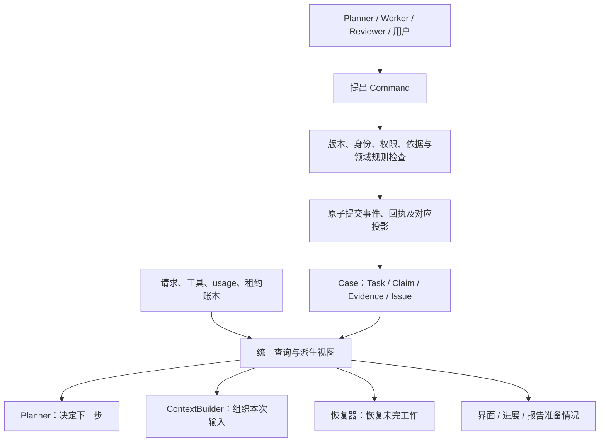

# Ariadne 状态归属与简化设计草案

> 本文下方保留改造前的讨论。已确定的 v2 方案及实现验收见
> [持续调查改造记录](../architecture/incident-agent-v2.md)。明确取舍为：
> 新案件默认 `token_limit=null`，无任务预算；移除 Ariadne 轮次/角色周期限制；
> 旧案件只读，新流程使用 `v2/` 数据库和 artifacts，不执行旧案迁移。
> 下方关于迁移继续执行或尚未确认预算的建议已被上述决策替代。

2026-09-28。依据当前代码审计，承接[架构地图](../architecture/incident-agent-architecture-map.md)和用户对 P1–P10 的反馈。
本文是统一设计草案；没有实施下面的数据迁移或运行逻辑改造。用户已要求去除 Ariadne 的
`max_turns` 与 `role_timeout_seconds`，并认可前述改进方向；token 预算是否完全移除仍属设计讨论。
本轮不运行真实模型，不修改现有验证总额度或真实案件预算。

## 1. 目标与原则

避免给 Planner、worker、恢复器和报告器分别增加一份工作记忆、计划、进度和完成判断。
每个事实只有一个权威写入路径；其他模块通过查询或可重建投影使用它。
同一信息出现在不同视图中是允许的，但不能由多个模块独立修改。

区分四类记录：

1. 领域事实：任务契约、证据、判断、用户暂停、已接受结果，由领域 Command/事件更新。
2. 执行事实：请求、usage、租约、错误、工具执行，在对应事务和执行账本中记录。
   它们并非全部包含在领域事件流中，不能声称只重放领域事件就可重建全部执行细节。
3. 派生视图：任务进展、案件运行状态、Planner 输入、报告准备情况，从前两类构建。
4. 冻结快照：实际发出的请求、历史报告及判断版本，为审计保留，不随当前状态覆盖。

## 2. 现有重叠审计

| 现有表示 | 结论 | 简化方向 |
| --- | --- | --- |
| Task / Attempt | 必要区分：工作可以跨多次执行 | 保留身份；任务完成与一次执行结束分开 |
| Task.status / Attempt.status / Case.investigation_status | 有关联，但现有 Task.needs_review 混入执行失败，Case 状态也混合人工意图和运行概况 | 显式意图和执行事实分开，运行展示由统一投影产生 |
| Finding / 拟新增工作记录 | 内容确有重叠；但当前 SubmitFinding 会结束 attempt，partial 也结束并把任务放入 needs_review | Task 增加版本化 progress 内容，支持非终结提交；复用结果内容 schema，Finding 保留为正式提交快照 |
| Claim.support/opposition/premises / dependencies | 同一组关系的两种表示，当前校验两者必须一致 | 选一种为权威；建议 typed dependencies 为内部表示，分组字段作兼容只读视图 |
| Hypothesis/Assessment / Claim | 前者只有类型定义，未接入主要案件流程，可能引入第二套判断管理 | 删除未接线类型或保留迁移兼容；工作假设使用待确认 Claim 与任务引用 |
| ReportBuilder.complete / quality.validate_quality 的报告检查 | 同一交付规则分散在两处，存在修改不同步风险 | 提取一个纯领域策略；构建与事务提交时分别对各自快照执行同一策略 |
| ReviewIssue.status / disposition / repair task 状态 | 含部分冗余，也含不同事实：审查意见不等于修复执行结果 | 分离审查结论和处理状态，删去可推导组合；修复执行状态来自 Task/Attempt |
| TaskAttempt.basis/reads/manifest / manifests 表 / RequestSnapshot.selection | 多份读取信息；请求选择清单是历史事实，聚合 manifest 可派生 | 明确来源；聚合清单和索引可重建，不允许模型或多个模块分别编辑 |
| Case 内 Finding.proposed_claims / Case.claims | 历史提交内容与当前判断投影，属于合理重复 | Finding 保持冻结；当前判断只由案件投影更新，不回写历史 Finding |
| Report / MemoryCard | 交付快照与跨案件检索投影，生命周期不同 | MemoryCard 由指定报告版本构建，校验源版本，不作为第二份当前调查事实 |
| incident_actions / Case 状态 | 前者描述入口请求排队/执行，后者描述案件；并非重复任务表 | 保留职责，入口完成不代表案件诊断完成 |
| execution spans / Attempt | 操作观测与任务执行身份不同；历史上曾混淆两者恢复边界 | 领域状态以有效执行身份和回执为准，span 记录/核对执行，不反向宣布任务完成 |

`planning_done` 等当前局部变量是一次调度调用的控制信息，不是已经存在的持久 Planner 状态。
可以保留可丢弃的调度缓存，但缓存必须随相关案件版本变化失效。

## 3. 建议保留的概念及归属

| 概念 | 只负责什么 | 不应承担什么 |
| --- | --- | --- |
| Case | 案件范围、症状、用户控制意图、领域对象集合 | 独立维护一套与任务不一致的进度百分比或假设列表 |
| Task | 一个持续工作目标、契约、依赖、当前已接受进度 | 模型请求和容器的执行细节 |
| Attempt | Task 的一次拥有有效代次的执行；失败、取消、恢复关联 | 跨执行的第二份计划或假设内容 |
| Evidence / Observation | 已取得数据及来源、覆盖、版本 | 代替模型解释事故原因 |
| Claim | 工作假设及因果/排除/诊断判断的统一版本体系 | 独立保存另一份工具原始数据 |
| ReviewIssue | 对具体 Claim 版本提出的检查与缺口 | 复制修复任务的执行状态 |
| Finding | 正式结果提交的冻结快照与依据 | 成为第二套可变工作状态 |
| Report / MemoryCard | 交付快照与历史检索投影 | 决定 live 任务是否运行 |

这些概念仍多于一个对象，但分别解决持久工作、并发执行、证据和审计的不同需求。
不为追求数量少而合并 Task 与 Attempt：否则旧执行晚到、重试计账和取消都会失去清晰身份。

## 4. 工作进度归入 Task

不新建独立 WorkLog 服务、PlannerMemory 或 AgentScratchpad。
建议 Task 有一个版本化 progress 字段，历史更新由已有领域事件保存。

内容限于：

- 已取得的证据引用与简短解释。
- 已尝试的方法和实际结果，尽量引用工具执行记录。
- 尚未解决的问题及下一步建议。
- 相关 Claim ID；假设正文与支持/反证关系仍归 Claim。
- 可继续使用的分析脚本、输出 artifact 引用。

模型可提出下一步和解释，但已运行工具、已读材料、消耗、状态由运行时提供或复验。
progress 不保存另一份预算、不复制整个聊天、不成为可绕过审查的完成声明。

复用 Finding 的观察、缺口等内容 schema，抽取共享结果内容；生命周期分为：

- 更新进度：保存可恢复内容，允许继续当前 attempt，不结束 Task。
- 提交结果：复用内容并执行正式 Finding 校验，保存冻结结果，按领域规则更新任务。

不能直接复用今天的 SubmitFinding 写进度，因为它会把 attempt 标为 succeeded。
需要非终结命令和明确的版本规则。允许一个 attempt 多次更新进度，最终一次提交结果。

同 Task 默认只接受有效 active attempt 的进度写入；用 task/contract/progress 版本、
执行代次和幂等 command_id 校验。旧 attempt 晚到不得覆盖新进度。
并行独立工作使用不同 Task，更新结果在 Case 汇合。
中途崩溃无法保证生成最后一条模型摘要：恢复使用最近接受进度和之后的工具/证据记录。

## 5. 状态如何统一更新

Planner 读取同一案件投影，输出 Decision 与任务建议；不另建持久计划状态机。
ContextBuilder 是投影器，不维护另一份权威调查摘要。它可以缓存，但应带来源版本。
Runtime 负责生命周期与调度；持久写入最终通过 Store 的事务边界。
Trace 与 UI 消费事实，不自行宣布领域结果。

Case 的人工暂停/关闭意图必须显式保存；“运行中/等待中”由有效 attempt、待满足条件、
就绪工作和拥有者状态得出。Task 的展示状态亦由任务意图、依赖、等待和执行/结果得出。
可保存这些物化视图提高查询效率，但必须可重建，并由同一 reducer 规则更新。

## 6. 取消不必要的运行上限

按用户要求，后续实现从 Ariadne 移除 `max_turns`、`role_timeout_seconds` 的配置和执行限制，
不把 8 轮或 300 秒替换成新的默认硬边界。Tau 的通用可选参数无需删除，调查不设置它。

必要边界仍有明确归属：

- provider 单次请求/连接超时：处理网络挂起，属于传输设施。
- 工具执行超时与资源限制：例如隔离脚本，属于工具设施。
- 用户暂停/取消、所有权租约：属于运行控制。
- 可选 checkpoint_steps：用户设置的阶段性暂停，不构成诊断失败。
- 上下文窗口与输出长度：一次请求的技术约束，不是累计调查预算。

压缩上下文不必结束 attempt；运行所有权丢失或进程中断后的恢复才创建新 attempt。
长周期通过 Task.progress 和证据积累连续推进。

## 7. token 策略：去掉重复限制，保留记账

建议取消独立 Task 累计 token 上限，以及默认 Case 200000 token 硬上限。
Case 累计限额改为可选的外部运行政策，默认未设置；如用户不配置，则只记账不按总量停机。
这是设计建议，尚未改动当前代码。

usage 仍按 request_id 在现有请求账本中记录，Case/Task/Attempt 总量通过聚合获得；
Planner、worker 和报告不各自记账。未知 usage 保留估算，实际值和估算明确区分。
未设置累计预算时，不预留整个 context window 作为派发门槛；设置了预算时，在请求发送前
原子检查实际输入估算加输出 allowance，未知用量保持保守处理。

现有真实验证的 400 万总额度仍有效，旧 Case 预算不因默认值变化自动解除。
取消或迁移已授权限额需显式政策变更和事件记录。本轮不调用模型，也不申请增加额度。

## 8. P1–P10 收敛后的四项改造

| 改造 | 涉及问题 | 复用的事实来源 | 避免新增的重复状态 |
| --- | --- | --- | --- |
| Task 进度与可恢复执行 | P1、P2、P7 | Task、Attempt、工具记录、Finding 内容 | 独立工作记录系统、每角色记忆 |
| 一套调查与交付策略 | P3、P4、P9、P10 | Claim、ReviewIssue、任务/证据变化、Decision | Planner 假设表、Reviewer 进度表、多份完成判断 |
| 请求上下文与工具接口 | P5、P8 | Task.progress、Evidence、Claim、不可变 artifact | ContextBuilder 自有工作数据库、工具副本账本 |
| 可选预算政策与统一 usage | P6 | 请求账本及用户政策 | Case/Task/worker 三套独立额度与消耗 |

无进展判断应读取同一组证据版本、检查结果和任务进度。不要另增一套“进展事实表”，也不能
以新 Claim 数量或新记录数机械等同有效进展。可把下一步决定及理由记入已有 Decision。
审查与报告准备情况使用同一领域策略，事务提交时重新核对；无关旁支仍需显式关闭或列为
非阻塞项，不能静默丢弃关键反证。

## 9. 实施顺序和验证边界

1. 确定权威字段和投影；建立旧事件/数据库兼容策略，保留身份、回执、未知 usage。
2. 引入非终结进度更新与恢复路径；在同一改造中移除角色轮次/周期时限。
3. 合并诊断完成策略和审查调度策略，简化状态含义。
4. 调整上下文、分析接口和预算政策，更新全部入口、文档与离线复现。

每一项应有单一责任模块和跨模块契约测试。重点验证：事件重放、重复提交、旧 attempt 晚到、
暂停后继续、读取依据改变、人工撤回、报告失效、未知 usage 和旧政策迁移。
状态展示允许物化，但测试应验证从权威记录重建后相同。
保留既有 Stage 历史；上述改造完成后重新核对验证矩阵，不因简化概念而缩减原交付范围。
