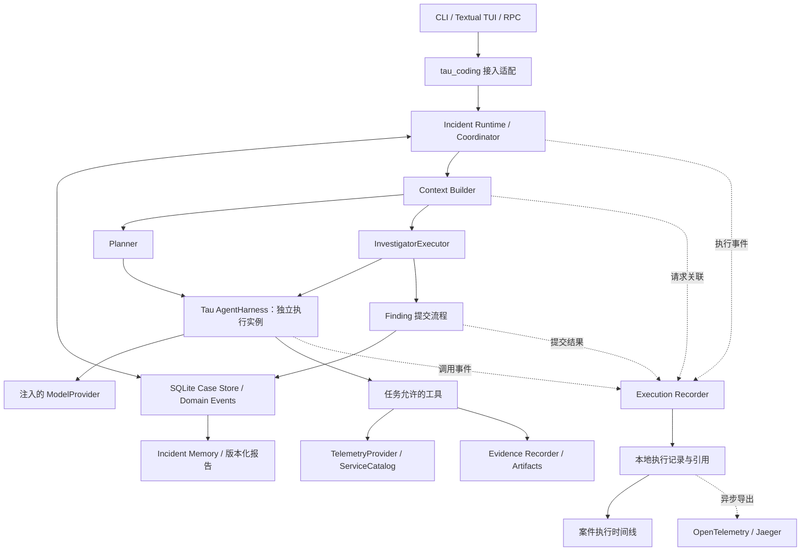

# 基于 Tau 的长期故障调查 Agent：目标设计

2026-09-28 补充：现行持续调查设计见[统一改造 v2](../architecture/incident-agent-v2.md)。
案件默认无 token 限额，角色不设轮次或总周期限制；进度通过 Task.progress 非终结提交。
旧库只读，新流程独立使用 v2 存储。下方初版中的旧预算或迁移设想以此次取舍为准。

状态：目标设计定稿；Stage 1–6 实现完成，待统一验证；Stage 7 验证中，见[统一验证记录](../architecture/incident-agent-validation.md)。
本文描述完整目标能力，不表示当前 Tau 已实现全文功能。实际状态见阶段索引。

日期：2026-09-26。源码基线：`c66fb87`，`tau-ai 0.4.5`，Python 3.12+。

实施安排见[总实现计划与 Stage 索引](incident-agent-implementation-plan.md)。本文规定目标架构和正确性要求，阶段计划规定实现顺序、检查与统一验证时序。

## 1. 产品目标与交付范围

围绕持续存在的 Incident Case，调查 Agent 获取可追溯证据、形成和修正故障解释，并在上下文切换、进程中断、数据延迟和判断变化后继续调查。

直接交付完整目标版本：案件与证据管理、假设驱动调查、请求级上下文、有界并行、重要结论审查、局部修复、恢复、历史事故记忆、等待与预算控制、执行链路追踪、版本化诊断和交接。按依赖关系实现并贯穿同一条调查流程，不以消融实验作为各模块是否开发的前提。

产品范围是只读调查、诊断、交接与处置建议。自动执行生产变更、分布式任务集群、通用工作流平台不纳入本次交付。诊断完成与业务恢复分别记录。

模型对比、数据集规模和论文复现实验保持精简。事务、并发、恢复、上下文协议等正确性要求完整保留；按用户确定的实施安排，实现阶段仅做必要的语法、导入和改动范围内的静态检查，测试编写、执行、缺陷修复与复测集中到最后一个 Stage。执行记录用于定位失败步骤、查看耗时和消耗，并为后续策略调整提供依据；验收说明已支持的行为，不预设准确率或成本改善数字。

### 已确认的使用方式

2026-09-26 用户同意以下建议：

- 在现有 Textual TUI 内提供案件工作区，展示调查状态、证据、假设、任务和报告，并可展开执行时间线查看失败步骤与关联依据；聊天用于提出问题与调整调查，保留原有 coding 模式。
- 支持通过人工描述或导入告警启动案件；启动后在权限与预算内自主调查。外部系统自动推送的具体接入建议见下文，尚未部署。
- 交互运行时退出应用会保存并暂停调查；显式启动常驻后台模式后，断开前端不停止调查，重新连接可以查看进度。
- 人工输入区分补充观察、候选解释和执行约束，并保留来源。用户可以暂停或调整方向；人工解释同样需要证据支持。
- 提供隔离的 Python 分析执行器，用于处理已取得的证据；模型不能因此获得宿主机的任意执行权限。

实现时采用有 schema 的输出与有次数上限的格式修正；支持多个候选原因、组合原因及传播路径。上下文检索先按环境、实体和时间范围筛选，再按相关性选择，并保留关键反证和缺口。历史记忆按项目和环境隔离，跨环境引用显式说明差异。

## 2. 架构与 Tau 边界

遵循 [Tau 路线图 #1](https://github.com/huggingface/tau/issues/1) 的职责分离：Harness 是可复用执行核心，应用层提供环境，前端消费事件。



- `tau_agent` 保留模型协议、消息、工具、循环、Harness、通用事件与会话原语。复用现有事件及订阅接口，新增通用请求上下文接口；不引入 incident 模型、存储路径、UI 或 OpenTelemetry SDK 依赖。
- `tau_ai` 提供模型适配实现；`ModelProvider` 协议当前实际定义在 `tau_agent/provider.py`。通过注入连接，领域代码不绑定供应商。
- 新增 `tau_incident`，依赖 `tau_agent` 的公共协议，拥有领域模型、上下文、工具适配、存储、调度、执行记录、报告和记忆。
- `tau_coding` 提供 provider 配置、命令、会话绑定、生命周期以及 TUI/RPC 接入；向领域层注入 provider、时钟、路径和配置，并负责 OpenTelemetry 导出适配与运行配置。
- 调查执行直接使用独立 Harness，显式提供工具、提示词、记录器、取消状态和预算，不自动继承 coding 工具、项目指令或主会话历史。
- 新增包时同步 `pyproject.toml` 的打包和类型检查配置。具体工具、状态与使用行为实现后更新 `website/content/`。

外层循环：读取案件 → 规划 → 派发 → 接收 Finding → 修订 → 继续、等待或结束。

内层循环：一次任务中的模型与工具交互，由 Tau Harness 执行。当前 `run_agent_loop()` 在单次响应后逐个执行工具；任务并行由外层调度多个 Harness 实现。

Execution Recorder 统一接收 Harness 事件、provider 调用边界以及 Runtime 的上下文构建、调度、证据登记和提交结果。每个操作记录为 span，即有开始、结束和结果的一段执行。运行时直接产生记录，失败后无需模型补写过程；现有消息事件不能覆盖的调用与异常边界由适配器补齐。

本地执行记录与 Case 共用 SQLite 存储设施，使用独立表和查询接口，引用已有的请求快照、artifact 与领域事件。案件时间线读取这些记录；OpenTelemetry 适配器异步导出 span 元数据及关联信息。领域提交和恢复始终使用 Case Store 的权威记录，不依赖外部观测平台。

## 3. 领域模型与不变量

领域对象和关联的执行记录采用 Pydantic 模型或 typed dataclass。数据库状态是系统统一采用的调查记录；其中的解释仍可能被修正。

| 对象 | 必要内容 |
| --- | --- |
| IncidentCase | 案件 ID、环境、症状、影响范围、事故时间窗、调查状态、影响状态、版本 |
| EvidenceRecord / Observation | 运行时 ID、来源操作及可选 attempt、实际查询、数据时间与可用时间、采集时间、实际覆盖、单位、采样/截断、完整性、原始 artifact 与 hash |
| ClaimRevision | 可检查的判断、适用范围、支持/反对的证据及版本、推理前提、修订原因、当前有效性 |
| Hypothesis / Assessment | 候选机制、涉及实体或调用边、支持与反对依据、未解释现象、状态与评估版本 |
| InvestigationTask | 任务类型、目标、范围、完成条件、前置任务、工具权限、预算、任务契约版本 |
| TaskAttempt | 独立执行 ID、任务契约版本、起始 Case 版本、依据清单、执行状态、成本、trace 引用、取消与提交记录 |
| RequestSnapshot | 请求 ID、交给 ModelProvider 的输入、模型与配置、工具定义、上下文选择清单及相关版本 |
| ExecutionRecord | schema 版本、操作 ID、操作类型、关联 ID、起止时间、耗时、状态、错误分类、结果及已有记录的引用 |
| Finding | 观察引用、候选判断与状态变更、依据、反证、缺口、新问题、完成情况 |
| Decision / ReviewIssue | 调查选择及理由；或待复核的具体判断、缺口、影响、处理要求 |
| WaitCondition | 来源、数据范围、可检查条件、下次检查时间、期限、超时处理 |
| DiagnosisReport / MemoryCard | 来源 Case 与诊断版本、依据截止、验证状态、适用范围、修订与撤回关系 |

执行记录的关联字段包括运行代次、`trace_id`、`span_id`、父 span 与 links；按实际归属补充 `case_id`、`task_id`、`attempt_id`、`request_id`、`tool_call_id`、`command_id` 及证据、判断、事件版本的引用。ID 由运行时生成或从已有协议继承，不能由模型编造；不属于任务的操作无需虚构 TaskAttempt。每次实际工具执行有独立操作 ID，保留其模型工具调用 ID，以区分调用与重试。

操作完成状态与结果含义分别记录：成功、失败、取消、中断和结果未知描述执行状态；无匹配、部分数据、过期或提交拒绝描述具体结果。错误分类覆盖模型/网络调用、数据源、schema/消息协议、上下文和提交校验。调查质量问题关联 ReviewIssue、人工反馈或环境验证的来源，不能仅凭工具成功就标记结论正确。

关键规则：

1. Evidence ID、实际查询与来源信息由工具运行时登记，模型只能引用。确定性统计还要记录计算方法、输入、单位和基线；未经工具核实的模型推断记录为 Claim。
2. “CPU 最大值 32%”与“服务正常”是不同层次的信息。阈值、比较基线和诊断意义必须有依据。
3. 实际覆盖未知时明确标记未知，不能由请求范围推断采集完整。成功但无匹配数据、部分结果、查询失败分别表示。
4. 判断具有环境、实体、时间窗等适用范围。服务、实例/节点、调用关系、部署和配置都可以成为假设对象。
5. 原始证据保留；被撤回、纠正或不适用于当前问题时，通过追加记录改变其适用性。依据失效触发复核，不直接将结论判为错误。
6. 支持/反对、由某判断推导、由某决策触发任务，是不同关系。局部修复沿推理依据传播；任务触发关系用于追踪调查过程。
7. Session 保存交互；Case 保存调查；RequestSnapshot 保存本次模型输入；ExecutionRecord 保存执行过程；Incident Memory 保存历史经验。聊天分支、压缩或清空不回滚 Case。历史重演使用隔离 Case 副本。
8. 事件重放确定性重建已提交状态；重新调用模型或查询环境不保证重现相同轨迹。
9. 领域事件记录已接受的状态变化，证据记录保存观测来源，执行记录描述操作过程。三者通过引用关联，各自保留职责；span 的父子关系或 links 不作为故障因果证据，也不代替判断依赖。

## 4. 判断提交协议

Investigator、Planner、Reviewer、用户修正和导入入口，统一通过领域 Command 提交。模型或前端不直接覆盖数据库中的 Case。

### 4.1 工具执行与证据登记

工具适配层在调用前登记操作身份、实际查询参数及环境范围，结束时记录耗时、状态和结果引用。原始 artifact 完整落盘并计算 hash 后，通过 Evidence Recorder 登记来源与覆盖信息，返回可引用的 Evidence ID。执行记录引用该证据及 artifact，避免重复保存完整结果。没有被引用的孤立文件可以后续清理；不能把文件写入误称为 SQLite 事务的一部分。

有效观测可以在任务完成前独立登记，因此任务中断不会自动丢弃已取得的数据。数据是否支持某个解释另行处理。

### 4.2 Finding 的接受流程

1. 校验 schema、来源执行、允许引用的证据、权限、适用范围和任务完成条件。TaskContext 中已有的合法证据也可引用，不要求证据全部由当前任务产生。
2. 比较任务依据与当前状态，区分可接受、需要复核、已被替代等情况。
3. 对语义冲突或重要判断执行审查；模型分析、工具查询和审查全部在数据库事务外完成。
4. 开启短事务，再次检查相关对象版本、有效执行身份和预算预留。若期间条件变化，退出事务重新评估；重试受限，不能无限竞争。
5. 在同一事务中追加领域事件、运行纯函数 Reducer、更新状态投影、任务与执行状态、提交回执，以及相应预算结算和派生更新标记。

Command 带稳定的幂等 ID 与内容 hash。相同 ID、相同内容返回原提交回执；相同 ID、不同内容报冲突。每个 attempt 最多接受一个最终结果。一次模型自由文本结束不等于任务已经有效完成。

提交记录关联来源执行、Command 和检查所用版本。接受结果以事务提交后的回执、领域事件 ID 及实际版本变化为准；拒绝、冲突、重复提交和取消记录各自原因。事务结果未知时保留未知状态，并通过幂等 ID 查询回执后核对，不能仅凭 span 结束就认定提交成功。

Runtime 校验可检查的约束；模型解释证据含义；Reducer 只应用已接受的事件。引用有效或审查通过均不自动证明因果成立。

## 5. 并行、任务依据与执行身份

每项 Task 的契约包含目标、范围、完成条件、工具能力与关键前提。改动这些条件时形成新契约版本，必要时创建替代任务，避免静默改变正在运行的 worker。

每个 Attempt 包含：

- `task_id`、任务契约版本、独立 `attempt_id`；
- 起始 Case 版本、runtime 所有权代次和有效执行标识；
- 本次执行的 trace 引用，以及派发、重试、恢复或替代来源的关联；
- 启动时的依据清单：Claim/Hypothesis 评估版本、拓扑/配置版本和查询范围；
- 执行期间的读取记录、每次请求的上下文清单，以及最终 Finding 实际引用的依据；
- 独立 Harness、消息记录、取消状态和预算预留。

依据清单不是只记录派发时的提示词。运行时记录模型获得的数据；模型在 Finding 中显式声明推理依据。二者共同用于审计，不能声称完整捕获了模型所有隐式依赖。

每个 TaskAttempt 形成独立 trace，内部包含上下文、LLM、工具与提交操作。未归属任务的规划和调度等操作使用有明确起止的 trace。整个案件按 `case_id` 汇总；派发、异步返回和新的 attempt 用持久化的关联 ID 与 span links 连接，无需维持一个贯穿案件所有等待期的开放 span。该关联方式对应 [OpenTelemetry span links](https://opentelemetry.io/docs/concepts/signals/traces/#span-links)。

并行任务显式传递和隔离执行上下文，跨进程恢复从存储重建关联。每个执行内部保留事件顺序；案件状态顺序以领域事件序号和版本为准，不能用不同操作的墙上时钟时间推断依赖。

| 返回情况 | 提交处理 |
| --- | --- |
| Case 更新与任务依据无关 | 校验后接受 |
| 关键前提、范围或引用版本变化 | 保存有效观测，解释进入复核 |
| 出现语义冲突 | 保留双方依据，建立明确 ReviewIssue |
| 任务取消、被替代，或 attempt 已过期 | 记录迟到结果；不能完成当前任务或覆盖判断。可用证据需通过明确采纳流程 |
| 同一 attempt 重复提交相同结果 | 返回原回执，不重复改变 Case |

默认最多同时执行两项独立调查，可配置。依赖未完成、资源受限或缺乏预算时不派发。Reviewer、修复任务同样占用执行额度，避免绕过限制。

采用单机 Runtime；每个 Case 同时只有一个有效协调者，其他入口经它提交或只读访问。进程所有权与执行代次用于防止旧协调者、旧 attempt 的迟到提交。SQLite 短事务和提交时版本检查承担一致性，不持有数据库锁等待网络调用。

## 6. 请求级上下文协议

### 6.1 三种视图

| 视图 | 必含内容 |
| --- | --- |
| CaseBrief | 影响、进度、主要判断、待办、等待与未决问题 |
| DecisionContext | 当前问题、竞争假设、关键反证、未解释现象、近期变化、已查范围、在途任务、预算与可用信息源 |
| TaskContext | 固定任务契约、相关事实/判断版本、支持与反对证据、数据缺口、工具权限、完成条件 |

任务执行期间，动态上下文选择在任务契约内展开或收起证据细节，并纳入本任务的新观察。不能每轮直接用最新全案状态替换 worker 前提。新证据改变任务成立条件时，由 Coordinator 显式决定继续、复核、取消或替代。

工具可以读到变化后的环境；结果记录数据时间、采集时间与实际范围，不能把任务快照误当成环境已被冻结。

### 6.2 通用 Tau 接口与顺序

在 `AgentHarnessConfig` 和 `run_agent_loop()` 增加可选、通用的请求上下文构建 hook。默认无 hook 时保持现有行为；领域实现与选择规则放在 `tau_incident`。

当前 `_provider_context()` 会过滤空失败消息并修复工具历史。新增路径为：

```text
为本轮分配 request_id，关联所属执行
  → 读取完整执行历史，开始上下文构建记录
  → 既有历史清理与中断修复
  → 请求上下文选择（副本，不改完整记录）
  → 严格检查投影后的消息协议
  → 检查最终输入预算并预留输出空间
  → 持久化请求快照和选择清单，结束上下文构建记录
  → 登记调用开始，调用 provider
  → 记录请求结果、usage 与执行状态，结束调用记录
```

先保存请求快照，才能在请求中断后追踪“当时准备发送什么”。记录的是交给 ModelProvider 的中立上下文；供应商适配器的最终 wire payload 属于另一层诊断，不混为一谈。

上下文构建与 LLM 调用通过 request_id 关联。构建、协议检查或预算预留失败时记录失败阶段，不伪造已经发生的模型调用。调用记录引用快照、响应和配置版本，并保存耗时、结束原因与可观测的 usage；实际再次调用 provider 使用新 request_id，关联重试来源。供应商 SDK 内部重试仅在可观测时单独记录，不宣称完整捕获所有网络尝试。

协议检查不能用自动补造“工具中断”结果掩盖裁剪错误。上下文选择破坏协议时应重建上下文或显式失败。一次助手响应中的多个工具调用和对应结果按完整单元保留、移除或遮蔽；保留调用 ID、结果身份、错误状态等协议信息。

### 6.3 选择与压缩规则

- 固定契约、关键前提、关键反证、未解决冲突与数据缺口具有保留优先级。
- 其余预算分配给近期工具交互、相关历史调查和可回取证据。保留必要的范围、版本、引用和省略标记。
- 原始 telemetry 作为数据提供，不充当系统指令。用户界面文本、原始数据与执行规则分开构建。
- 每次请求记录采用的证据/判断版本、范围、摘要来源、因预算省略的内容及输入估算。执行记录引用这份清单，使排障时可以从错误判断回查当时实际提供的上下文。
- 协议和关键材料无法同时放入预算时，返回明确的上下文不足结果，由 Coordinator 缩小或拆分任务，或交付带缺口的结果。
- 请求级选择负责本轮材料；任务摘要压缩已完成的局部过程；CodingSession compaction 负责交互历史。调查 worker 不叠加一套不知情的自动压缩策略。
- 选择尽量使用确定性筛选与排序。摘要只在需要时生成，并保留来源；无需每次请求调用额外模型。
- token 估算与 usage 统计必须针对投影后的请求，并包含 system、工具 schema、消息及输出预留。

## 7. 调查控制、审查和局部修复

Planner 使用结构化输出提出调查、等待、复核或结束建议。每项调查说明要解决的问题、可能区分的解释，以及不同结果如何改变下一步。Runtime 检查执行条件并持久化决定。

调度操作关联建议、接受的 Decision、输入 Case 版本和实际派发任务，并记录未派发、等待、取消或预算不足的原因。结构化输出校验失败及格式修正也保留调用关联，避免只看到最后一次成功结果。

任务目的包括探索、区分假设、补充验证、局部修复和审查；共用 Executor 与存储协议，按目的配置提示词、工具权限及结果 schema。无需按数据源固定拆分多个长期角色。

在最终诊断、重要假设排除、证据冲突或上游依据被修正时触发审查。Reviewer 可以按权限回取原始证据。输出必须指向具体判断、依据缺口、影响范围和可执行修正，而非只有一个分数。执行记录将被审判断及其生成请求、ReviewIssue、修复 attempt 与最终提交结果关联起来；审查意见的接受状态和验证来源随版本保存。

局部修复流程：

1. 登记依据的修订或适用性变化。
2. 沿明确的推理依赖找到需要复核的判断。
3. 依据环境、实体、时间窗等范围匹配，发现额外候选对象；范围重叠本身不构成失效依据。
4. 检查独立支持证据，决定缩小结论、补查、重新评估或替代。
5. 创建有目标的修复任务，经统一提交协议更新相关判断、计划和报告。

“因为怀疑数据库而创建业务调用链查询任务”属于任务缘由。数据库假设被排除后，查询发现的旧 endpoint 观测仍然保留。

对目标判断版本、问题类型、范围和依据版本组成的同一审查问题，维护稳定标识和轮数。只有新增相关证据、明确的新检查或人工补充，才允许开启新的复查周期。默认同一问题每个依据版本最多两轮修复，且受 Case 总预算约束；策略可配置。

无进展、相同争议重复或预算不足时，将问题保留为未决，转入等待、补充信息或带不确定性的报告。审查者不能无限要求另一个审查者，也不能用自己的分数宣告根因已经被证实。

## 8. 等待、预算与恢复

### 等待与生命周期

WaitCondition 保存来源、范围、可检查条件、下一次检查时刻、期限及超时动作。避免仅保存一段“等更多数据”的文本。

进入等待时记录原因并结束当前有界操作；唤醒检查和恢复执行建立新操作，通过 WaitCondition 与先前执行关联。时间线分别展示执行耗时、排队和等待时段，避免把等待时间当成模型或工具延迟。

某个任务等待时，其他就绪任务仍可执行。没有可推进任务、没有相关在途执行且未满足结束条件时，Case 才进入案件级等待。后台检查优先使用数据源游标、水位或轻量探测，避免反复调用模型。

Runtime 在运行期间执行计时/数据检查；进程退出后等待条件保留，下次启动立即检查已经到期的条件。无人值守运行通过常驻的运行入口承载，不宣称关闭应用后仍会自动执行。

交互模式由应用拥有 Runtime，退出应用时暂停；后台模式由常驻入口拥有 Runtime，前端只连接它。外部告警自动接入同样依赖接收服务与 Runtime 持续运行。

关闭时停止派发，取消或在有限时间内收尾执行，提交已取得的证据与执行状态。重启后接管属于旧运行代次的未完成任务，标记 interrupted；重跑创建新 attempt。不能仅因为某次 UI 重连，就将其他仍有效的任务认定为中断。

操作开始与结束的关键元数据本地持久化。恢复时用请求结果、提交回执和已登记证据核对未完成记录；无法确定的保留为中断或结果未知，并注明恢复时补记的时间与依据。不得补造正常结束时刻或成功结果，新执行继续关联旧记录。

### 预算

维护 Case 累计预算、任务额度与 attempt 消耗，覆盖规划、调查、摘要、审查、修复、重试及 provider 可观测的重试成本。并行派发前原子预留额度，结束后按实际消耗结算。

预算区分已用、已预留、可用，以及 usage 未知的请求。未返回 usage 的中断请求不能记作零消耗或直接退还全部预留；保留估算和未知标记，保守处理。

执行记录和预算结算引用同一份请求 usage，按请求身份去重；观测导出、重放展示及恢复补记不会再次计费或结算。时间线区分实际 usage、估算和未知值。

调用次数和截止时间可以明确限制；新的 Case 默认不设累计模型调用上限。可选的模型步数检查点按一次 `run`/`resume` 的所有角色请求计数，到点保存进展、暂停，同案继续时开启新周期而不清零累计 usage。旧 Case 的硬调用上限仍保留。token/金额限制受模型输出上限、usage 回报与计费信息影响，必须说明估算与实际值，不承诺精确到 token 的绝对花费上限。保留 token 安全余量；不足时从结构化 Case 生成确定性部分报告，不依赖再调用模型。

用户增加额度形成新事件，累计历史消耗不清零。

### 恢复承诺

已提交结果不丢失；只读任务允许至少一次执行；重复结果不会重复改变 Case；旧执行不能覆盖新任务；原始证据和当前判断分别处理。不恢复到模型生成一半的位置，也不提供真实环境状态回滚。

关键执行元数据、请求快照、证据和提交记录保留完整关联；高频进度通知可合并，保留的消息历史仍须满足协议要求。OpenTelemetry 导出通过有容量和重试上限的后台队列进行，不在 Harness 订阅回调中等待外部网络；导出失败或丢弃产生可见的观测缺口，不能使已提交操作被重新执行。本地关键记录写入失败时显式失败或暂停相关执行，并按已有回执核对结果，不承诺缺失记录仍能完整追踪。

## 9. Telemetry、拓扑和历史记忆

### 数据访问

显式实现 `TelemetryProvider`、工具目录和 `ServiceCatalog`，包括 metrics、logs、traces、deployments、服务/实例/节点标识、调用关系和配置版本。提供能力发现与覆盖信息，让探索性调查知道能查什么。

这里的 traces 指被调查服务的业务调用链。Agent 执行链使用独立的服务标识、数据范围与访问入口，通过 Evidence ID 关联所查询的业务 trace。即使共用观测后端，业务遥测适配器也必须限定查询范围，避免将 Agent 自身数据当作事故证据。

统一工具结果区分完整、部分、无匹配与失败；查询范围、分页、采样、截断和单位都可追踪。worker 只获得任务允许的工具，证据回取通过受控 ID 完成。

交付包含可查询、可重放的 FixtureProvider 与一套选定的真实只读遥测接入路径。真实接入复用相同协议；具体服务地址与凭证由部署配置提供。Fixture 通过模拟时钟和数据可用时间开放数据，独立于 session 数。评分答案与 Agent 可访问的数据和工具隔离。

### Python 分析执行器

通过受控查询取得证据后，将选定的证据文件只读挂载到独立 Linux 容器，提供单独的输出目录。默认禁止网络，限制执行时间、内存、进程数和输出大小；不挂载宿主目录、凭证或 Docker socket。容器权限由执行器配置，模型不能修改。

记录脚本、依赖环境版本、输入 Evidence ID、执行状态、标准输出/错误和输出 artifact。执行 span 关联这些记录，并保存耗时、退出码、超时或资源限制原因；脚本和输出文件使用 artifact 引用。派生结果通过 Evidence Recorder 登记来源，后续 Claim 引用这些结果。超时、失败和部分输出明确表示，不能当作成功统计。容器隔离是实际执行边界，提示词限制不能替代它。

### 演示环境方向与选型建议

2026-09-26 用户已确认：目前没有已选定的服务和监控环境，围绕可复现的微服务演示环境建设。

具体选型建议为 **OpenTelemetry Demo + Docker Compose**，贯穿在线调查和从同一环境导出的离线数据回放。实施时锁定 Demo 提交、镜像版本、部署配置与场景定义；回放保存可查询的数据集，不能只保存一条固定工具轨迹。

沿用其可观测性组件：Prometheus 查询指标、Jaeger 查询 trace、OpenSearch 查询日志；Grafana 用于人工观察。数据源通过统一 TelemetryProvider 接入。组件依据见 [官方架构](https://opentelemetry.io/docs/demo/architecture/)。

Agent 执行链通过应用层的 OpenTelemetry 适配器导出，可复用演示环境的 Collector/Jaeger 并独立标识。外部平台用于查看调用树和耗时，本地案件时间线查询执行与证据关联。导出默认只包含允许的元数据和引用，凭证不进入记录；请求正文、工具结果和敏感 artifact 按本地数据策略保存与访问，不直接复制到 span 属性。脱敏或省略内容时显式标记记录范围，避免将处理后的快照描述为完整原始输入。

优先贯穿 checkout/payment 调用问题：官方 `paymentUnreachable` 场景通过错误地址模拟 payment 不可达；另有 payment 调用失败、recommendation 缓存内存泄漏和 Kafka 队列问题等故障。依据见 [故障开关文档](https://opentelemetry.io/docs/demo/feature-flags/)。场景控制器独立掌握注入设置和标准答案，并检查提供给 Agent 的数据中是否包含直接泄露答案的调试信息。

服务目录来自部署定义并结合观测到的调用关系；版本化保存声明拓扑与实际观测。部署/配置变更历史由我们的环境管理适配补齐。故障开关改变不自动等同于真实 deployment diff，演示部署回归时需要实际变更及对应记录。

2026-09-26 用户已确认部署位置为 Windows/WSL2。建议微服务与遥测组件通过 WSL2 上的 Linux 容器运行；Docker 安装方式、可用内存和具体资源配额尚未确认。当前 [Docker 部署文档](https://opentelemetry.io/docs/demo/docker-deployment/) 列出应用约需 6 GB 内存和 14 GB 磁盘；宿主系统、开发工具及分析执行器需另外留出空间。本次讨论尚未部署环境。

### 外部告警接入建议

2026-09-26 讨论建议：在演示环境中配置 Prometheus 告警规则，增加 Alertmanager，经 HTTP webhook 接入 Amadeus。此项为本次提出的选型建议，尚未作为用户确认的具体外部集成记录。依据见 [Prometheus 告警架构](https://prometheus.io/docs/alerting/latest/overview/) 与 [Alertmanager 分组、路由和抑制](https://prometheus.io/docs/alerting/latest/alertmanager/)。

接收端属于应用接入层；领域层处理统一的 AlertEvent 与案件 Command。外部格式不进入 `tau_agent`。人工导入与 webhook 使用同一套规范化和案件关联规则。

若采用此路径，接收流程为：来源鉴权与格式校验 → 原始消息及接收记录持久化 → 返回成功 → 异步规范化与关联案件 → 通过统一 Command 创建或更新案件 → 调度调查。持久化前不能确认接收成功；单机实现可用 SQLite inbox 与明确处理状态，无需单独引入消息集群。

接收与异步处理分别记录执行，通过 inbox 消息 ID、Command 和 Case 关联；尚未关联案件的事件允许没有 case_id。重复投递保留处理回执引用，不会因新增一条接收记录而重复开案。此入口遵循相同的本地记录和导出故障处理规则。

需要分别处理：

- 投递去重、同一次告警发生的状态更新、多个告警关联同一案件。通知分组标识不是案件身份，同一规则恢复后再次触发也可能是新事故。
- 来源、环境、实体、规则、严重程度、开始/恢复/接收时间、原始引用及外部 incident ID。乱序和重复投递不能使旧消息覆盖较新的状态；无法判定时保留冲突。
- 显式配置哪些告警可自动启动调查，以及全局并发、队列与预算限制。告警风暴不能无限创建模型执行。
- 告警解除只更新该告警的状态；业务恢复需要观测支持，诊断和结案按 Case 流程处理。
- 已有企业事故管理平台时，保存其 incident ID 映射并明确由谁管理外部事故状态；Amadeus 单独管理调查进度。PagerDuty 等平台可通过 [事故生命周期 webhook](https://support.pagerduty.com/main/docs/webhooks) 提供入口。

统一验证阶段编写并执行重复投递、乱序更新、恢复后复发、接收后中断恢复以及告警风暴的针对性正确性测试。接入服务运行情况与消息处理失败应可观察。

### 历史记忆生命周期

MemoryCard 保存来源 Case、DiagnosisReport 版本、适用环境/拓扑/配置背景、症状、解释、关键证据、有效路径、失败路径和未决项。

模型诊断、人工复核、环境验证分别记录来源和证据；这些状态可以同时存在，不用单一等级掩盖验证范围。案件诊断完成不会自动成为“已证实历史根因”。未完成案件可生成调查记录型卡片，保留未完成性质。

来源 Case 重新打开或重要判断进入复核时，在同一权威提交中立即标记相关报告/卡片需要更新。内容重建可异步执行，但检索时必须检查来源版本和有效状态，不能在后台刷新完成前继续把旧卡片作为当前有效诊断。

记忆检索记录筛选范围、返回的卡片版本及有效性检查结果；生成和重建操作关联来源报告版本。执行记录可追踪历史经验进入了哪次请求，卡片中的验证状态仍以其来源记录为准。

保留旧版本审计，默认检索当前适用版本；有争议或未完成记录如被返回，要显式携带状态。历史案例用于提出候选解释与调查路径，不进入当前证据集合冒充本次观测。

## 10. 版本化报告与交互

DiagnosisReport 保存解释及传播路径、证据引用、重要替代解释的处理、未决问题、处置建议、验证状态、Case 版本和证据截止。区分完整诊断与当前进展报告。

提交前检查相关在途任务、待复核判断和输入版本。Planner/Reviewer 提出语义理由；Runtime 检查版本、必填内容及流程条件。处理方式为等待相关任务、显式取消已无必要的任务，或提交标明未决内容的当前报告。不能在关键调查仍可能改变结论时无说明地宣告确定诊断。

报告生成在事务外，提交时再次校验引用和前提版本。无关案件变化可以重验后提交；相关变化则重新生成或标记临时报告。

新证据形成新报告版本，旧版本不覆盖。业务恢复由相应观测支持，诊断报告不能代替恢复验证。

CLI/TUI/RPC 提供创建/绑定案件、查看进度与证据、运行/暂停/继续、补充观察或修正、预算扩展、报告与交接导出。会话仅保存 active_case_id 与必要交互信息。事件适配负责展示 Case、任务和等待状态，不把 Tau 的 agent_end/agent_settled 当成 Case 已结束。

案件工作区提供可展开的执行时间线，按任务、attempt、操作类型和问题分类筛选，展示耗时、消耗及记录缺口。用户可以从报告中的判断追溯到提交回执、生成请求的上下文、工具执行和原始证据；也能检查审查意见为何未采纳、修复是否提交、重启后从哪里继续。CLI/RPC 提供同等记录查询与结构化导出，外部 Jaeger 链接作为补充入口。

## 11. 代码组织与贯穿实现

```text
src/tau_incident/
  models.py
  coordinator.py
  executor.py
  context.py
  submission.py
  review.py
  budget.py
  recovery.py
  events.py
  store/          # SQLite、事件、Reducer、版本与回执
  execution/      # 执行记录、关联上下文、查询与时间线投影
  telemetry/      # Provider、工具、Fixture、真实适配
  analysis/       # 隔离 Python 执行、输入输出与资源限制
  evidence/       # 登记、artifact、回取与来源
  memory/         # 历史卡片、检索、更新与撤回
  reporting/      # 诊断与交接
```

名称是职责边界，不要求每个文件都成为独立服务。前端与 OpenTelemetry 导出适配留在 `tau_coding`；Provider 实现留在 `tau_ai`；通用请求 hook 留在 `tau_agent`。`execution/` 复用 `store/` 和 `evidence/` 的记录与 artifact 引用，不另建案件状态或完整内容存储。

先确定统一的执行身份、记录 schema 和引用规则，再贯穿同一个实际案件的“规划—调查—提交—更新上下文—报告”。每接入一个环节，同时记录其调用和结果；并行、审查修复、恢复与历史记忆沿用同一关联方式。案件时间线与 OpenTelemetry 导出消费这些记录，最终统一验收完整能力。这个顺序用于降低集成风险，不缩减交付范围。

每段实现保留开发记录、用户文档和静态检查结果，完成后标记“实现完成，待统一验证”。最后一个 Stage 集中编写并执行测试：模型输出使用 FakeProvider，时钟、工具和观测导出器使用 fake，验证状态、关联与失败处理；再覆盖完整调查流程和受影响的 Tau 原有功能，并完成缺陷修复与复测。验证通过后统一更新状态。Python、测试与检查统一通过 `uv` 运行。

## 12. 精简验收清单

| 场景 | 必须成立的行为 |
| --- | --- |
| 配置错误导致调用旧 endpoint | 区分服务自身与调用路径；报告判断可追溯到上下文、工具查询、证据和提交回执 |
| 中断、重启、重复提交 | 已提交状态不丢失；新 attempt 独立且关联旧执行；重复提交引用原回执；未完成操作保留中断或未知状态 |
| 晚到数据、错误查询范围 | 区分事件时间与获知时间，重新打开判断，仅复核相关依赖 |
| 数据源失败或覆盖不全 | 保留数据缺口；执行记录区分调用失败、部分数据和无匹配；不用空结果排除故障 |
| 并行结果与旧执行晚到 | 无关更新可合并；过期解释复核；旧 attempt 不覆盖当前任务；执行关联不串入其他任务 |
| 等待与预算耗尽 | 就绪任务继续；全案等待条件明确，等待与执行耗时区分；部分报告和后续恢复正确；观测导出不重复结算 usage |
| 关键证据退出上下文后再次需要 | 能回取范围与原始依据并查到请求选择清单；反证不被静默删除；消息协议有效；检查失败不伪造模型调用 |
| 相似历史案例误导当前判断 | 可查到引用的卡片及请求版本；当前证据驱动修正；来源诊断修订后卡片失效与更新正确 |
| 审查多轮没有新依据 | ReviewIssue、修复与提交结果可关联；到达停止条件并保留未决问题，避免无限审查 |
| 模型或 Python 分析超时、重试 | 每次实际调用身份独立；失败和成功均可追踪；脚本、输入输出及 usage 关联正确 |
| 观测后端不可用、本地写入失败 | 外部导出故障不阻断调查且缺口可见；本地关键记录失败显式处理，不能误报成功 |
| 业务与 Agent trace 共用后端 | 查询范围隔离；导出不包含凭证或未授权正文；业务证据通过引用关联执行记录 |

以上要求全部纳入[Stage 7 的验证矩阵](incident-agent-stage-7.md)。该阶段使用固定模型和少量代表场景完成端到端验收；事务、幂等、所有权、预算预留、消息协议和修复传播使用确定性测试覆盖。无需完整消融、多模型扫描或大规模 benchmark 才能交付。

## 13. 结论

目标架构和能力范围至此固定。后续实现围绕三项核心契约展开：统一判断提交、按依据处理并行结果、按任务契约构建请求上下文。执行记录使用统一身份与引用串联这些契约，支持从结果回查请求、证据和状态变化。审查修复、恢复、历史记忆和报告共同使用同一提交与关联方式。

